# Kbia — Flujos de Negocio

## Tabla de Contenidos

1. [Captura y procesamiento de contenido](#1-captura-y-procesamiento-de-contenido)
2. [Busqueda y descubrimiento](#2-busqueda-y-descubrimiento)
3. [Chat RAG](#3-chat-rag)
4. [Diario personal (ciclo diario)](#4-diario-personal)
5. [Gestion de habitos](#5-gestion-de-habitos)
6. [Organizacion del conocimiento](#6-organizacion-del-conocimiento)
7. [Autenticacion](#7-autenticacion)
8. [Quick Save (guardado externo)](#8-quick-save)
9. [Importacion masiva](#9-importacion-masiva)
10. [Procesamiento en background](#10-procesamiento-en-background)

---

## 1. Captura y procesamiento de contenido

Flujo principal: el usuario guarda una URL y el sistema la procesa con IA.

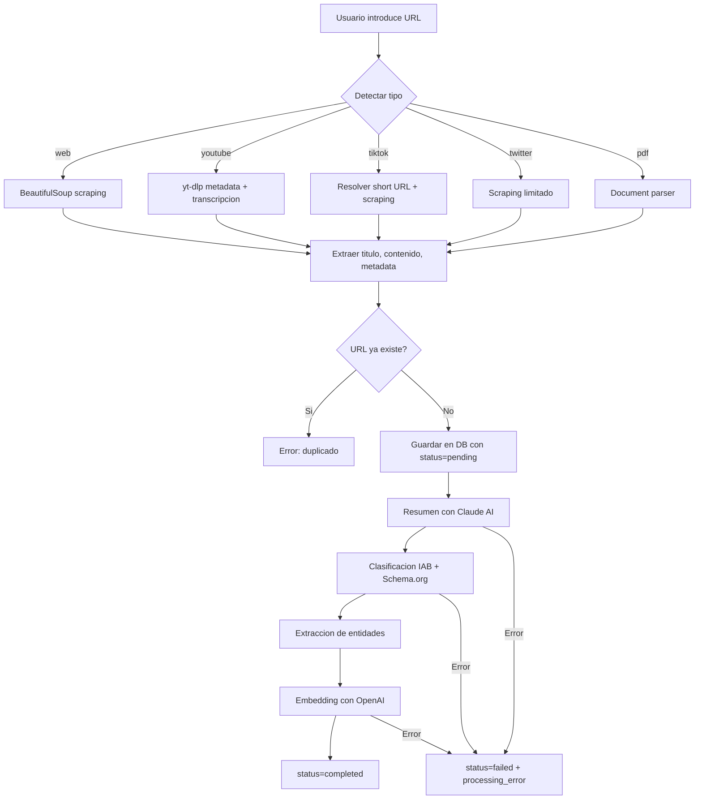

**Actores:** Usuario, Frontend, Backend API, FetcherService, ClassifierService, SummarizerService, EmbedderService, Claude API, OpenAI API

**Decisiones clave:**
- Deteccion automatica del tipo de URL por patron de dominio
- Duplicados detectados por constraint unique (user_id, url)
- Si el procesamiento falla, el contenido queda guardado con status=failed para reintento

---

## 2. Busqueda y descubrimiento

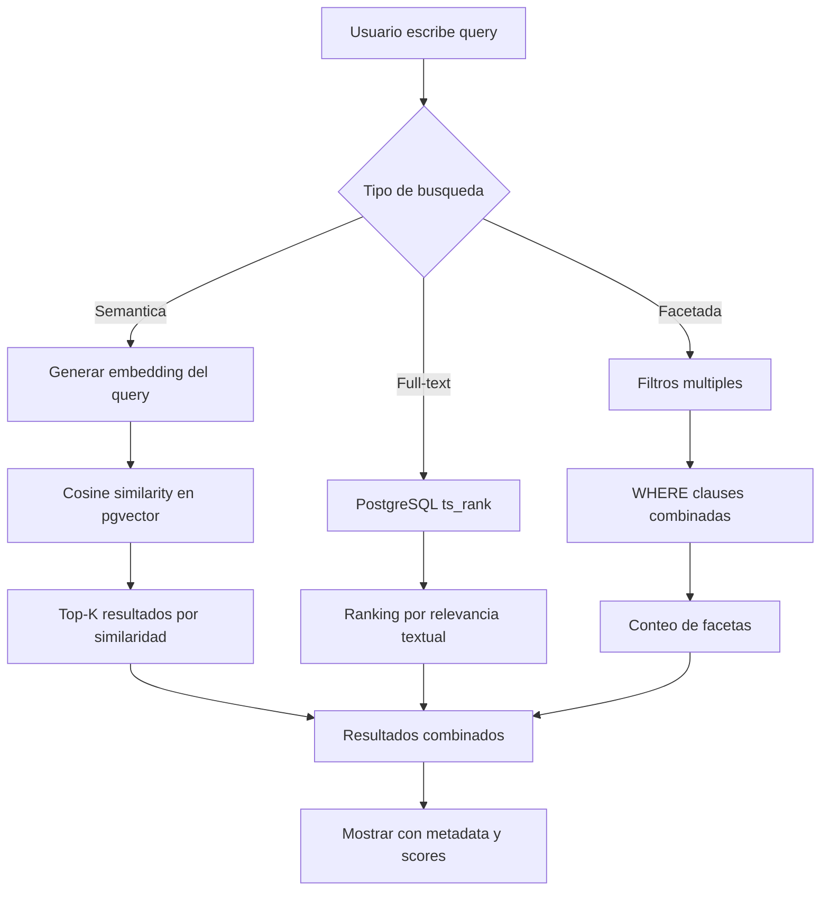

**Actores:** Usuario, Frontend (explorador/busqueda), Backend Search API, PostgreSQL + pgvector, OpenAI (embedding del query)

**Tipos de busqueda:**
- **Full-text:** Busca en titulo + resumen + conceptos + tags con ranking
- **Semantica:** Convierte query a embedding, busca por cosine similarity (threshold 0.7)
- **Facetada:** Filtros combinados (tipo, categoria, entidades, tags, fecha, estado)
- **Global:** Busca en todas las entidades (contenidos, notas, proyectos, etc.)

---

## 3. Chat RAG

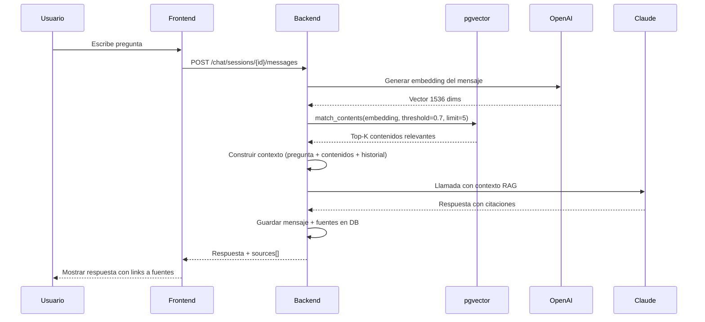

**Actores:** Usuario, Frontend Chat, Backend Chat API, OpenAI (embedding), pgvector (retrieval), Claude (generacion)

**Reglas de negocio:**
- Se recuperan maximo 5 contenidos relevantes por mensaje
- El historial de la sesion se incluye como contexto
- Cada respuesta lleva las fuentes citadas con content_id, titulo y snippet
- Se trackea tokens_used y model_used por mensaje

---

## 4. Diario personal

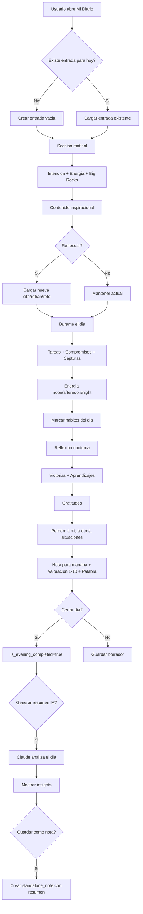

**Actores:** Usuario, Frontend Daily Journal, Backend Journal API, Claude AI (resumen), InspirationalContent (citas)

**Reglas de negocio:**
- Una entrada por usuario por dia (unique constraint user_id + date)
- Big Rocks pueden vincularse a objetivos o proyectos existentes
- Las capturas rapidas llevan timestamp automatico
- El dia tiene 3 fases: morning, day, evening (cada una con flag de completado)
- El resumen IA analiza patrones emocionales y temas recurrentes

---

## 5. Gestion de habitos

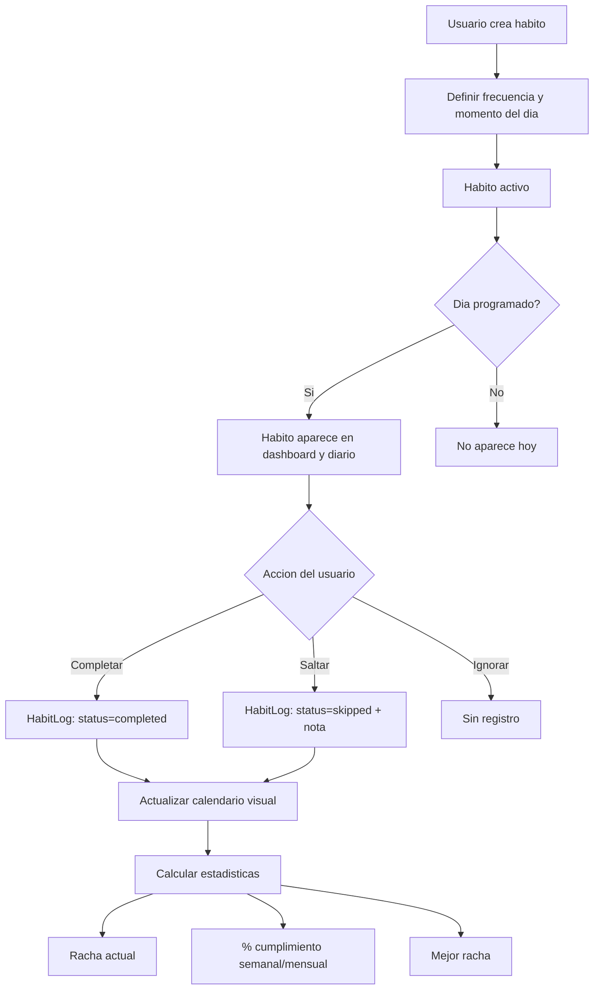

**Actores:** Usuario, Frontend Habits, Backend Habits API

**Reglas de negocio:**
- frequency_type: daily, weekly, custom
- frequency_days: array de dias (0=lunes, 6=domingo)
- time_of_day: morning, noon, evening, anytime
- Un log por habito por dia (upsert)
- Los habitos archivados no aparecen pero mantienen su historial

---

## 6. Organizacion del conocimiento

Relaciones entre entidades del sistema PARA.

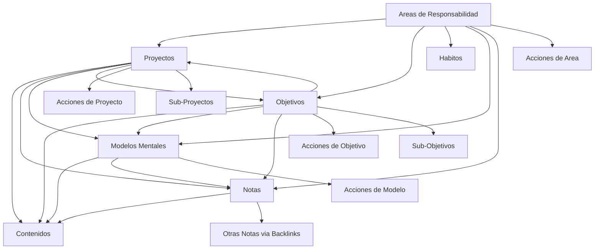

**Reglas de negocio:**
- Las relaciones son muchos-a-muchos via tablas junction
- Unique constraints en junctions para evitar duplicados
- Un proyecto puede pertenecer a un area y tener un proyecto padre
- Un objetivo puede pertenecer a un area y tener un objetivo padre
- Las acciones (tareas) pertenecen a exactamente una entidad padre
- Los contenidos pueden estar vinculados a multiples entidades

---

## 7. Autenticacion

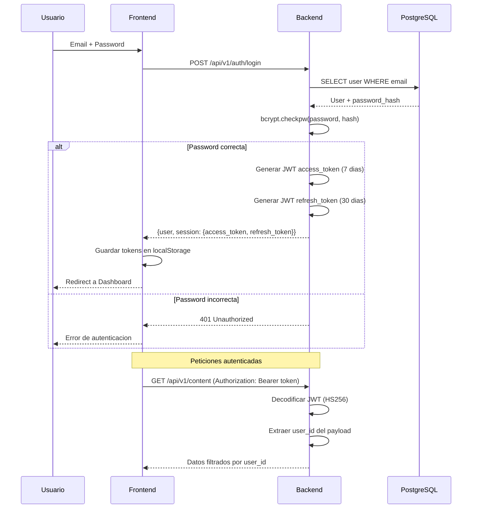

**Alternativa: API Key**
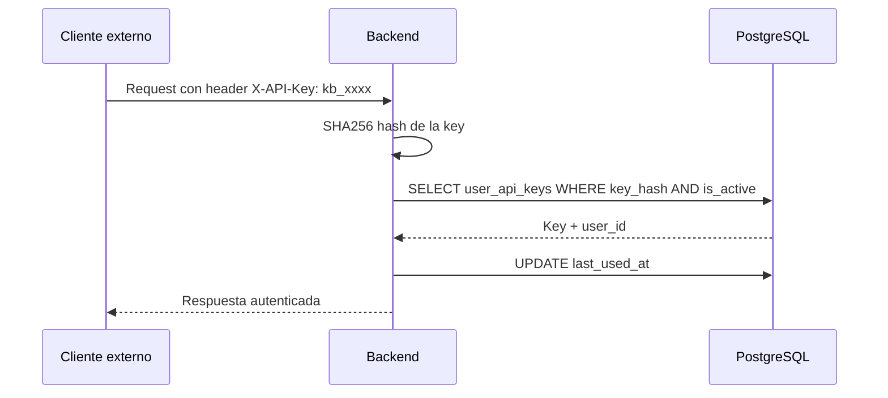

---

## 8. Quick Save

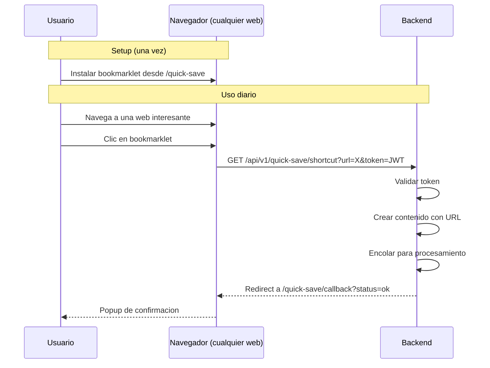

---

## 9. Importacion masiva

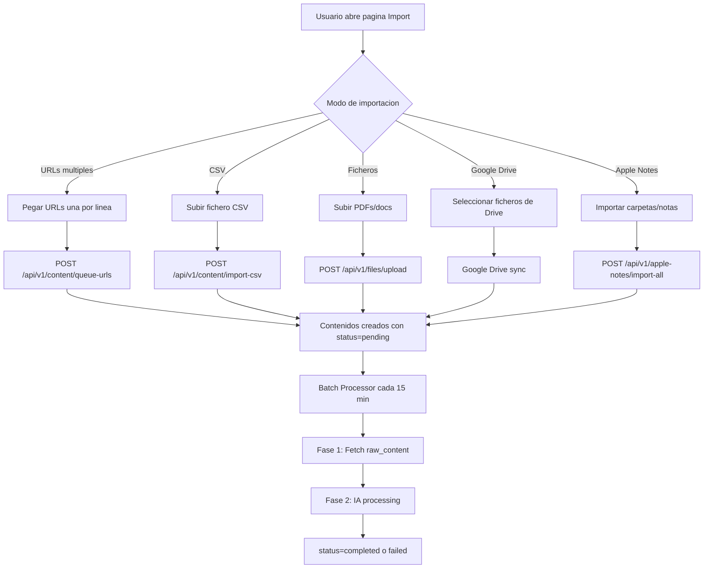

---

## 10. Procesamiento en background

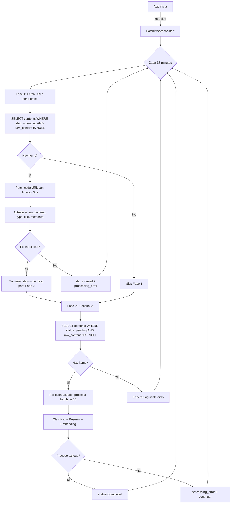

**Actores:** BatchProcessor (servicio en background), FetcherService, ProcessorService, PostgreSQL

**Reglas de negocio:**
- Se procesan maximo 50 items por batch
- Timeout de 30 segundos por URL en fetch
- Los errores se capturan por item (no rompen el batch completo)
- El procesamiento es por usuario para aislamiento
- El batch processor se detiene automaticamente al cerrar la app

---

*Ultima actualizacion: Abril 2026*
